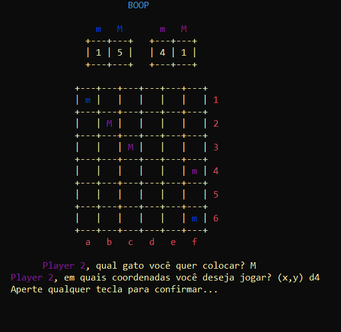

# Boop game
Adaptação digital em linguagem C do jogo de tabuleiro "Boop"

  Este projeto foi desenvolvido na disciplina Introdução à programação, ministrada pelo professor Roberto Hugo Wanderley Pinheiro da Universidade Federal de Campina Grande (UFCA), juntamente com os discentes Pedro Yan Alcântara Palácio e Rafael da Silva Sousa.

  <h1>Gameplay</h1>

  O jogo físico consiste num tabuleiro 6x6 em formato de cama, cada jogador começa com oito "gatinhos" e oito "gatões" (na reserva). O objetivo consiste formar uma linha com três gatões (gatos adultos) ou colocar todos os seus oito gatos do estoque no tabuleiro. A mecânica principal acontece ao colocar um gatinho ou gatão no tabuleiro, ele faz "Boop", ou seja, ele empurra todas as peças adjacentes (ortogonal e diagonalmente) uma casa, mesmo que pertençam ao próprio jogador. Há uma prioridade de empurrão: gatões empurram gatinhos e gatões enquanto que as peças dos gatinhos empurram apenas outros gatinhos. Caso uma peça caia pra fora do tabuleiro, ela volta para o estoque do jogador que a colocou. O empurrão pode ser evitado caso duas peças adjacentes estejam alinhadas no sentido do empurrão. 
  Quanto à formação de trios, inicialmente ambos os jogadores procuram formar um trio de 3 gatinhos, quando isso acontece, as 3 peças são retiradas do tabuleiro e do jogo, e 3 gatões entram para o estoque do jogador que formou o trio, a partir daí o jogador pode começar a usar gatões. Se três gatões do mesmo jogador se alinharem, o jogador vence. Também há a possibilidade de alinhar um gatão e dois gatinhos, ou dois gatinhos e um gatão, nessa situação, ocorre uma "graduação", na qual as peças são retiradas do tabuleiro e no lugar dos gatinhos, peças gatões irão ocupar seu lugar no estoque. Válido ressaltar que a peça colocada precisa empurrar as demais antes de ocorrer a graduação. 
  Exemplos práticos das regras descritas serão mostrados mais adiante.

  <h1>Versão digitalizada</h1>

  Após o download do arquivo main.c, basta compilar e executar no terminal. Depois da tela inicial o jogo incia com a vez do player 1.

  

  
  As peças "gatinhos" são representadas pelo caractere "m" e os "gatões" pela letra "M". As peças de cada jogador são diferenciadas pela cor, do player 1 são azuis e do player 2 são roxas. A quantidade que cada jogador possui para utilizar está logo abaixo do nome "BOOP".

  

  Primeiramente, o jogador digita o tipo de gato que quer jogar, m ou M (caso ele só possua gatinhos, como nos momementos iniciais, essa pergunta não aparece), e logo após as coordenadas (Ex: a1, b3, f6). Após o enter, o usuário aperta qualquer tecla para passar a vez para o próximo.

  

<h1>Demonstração das regras</h1>

  Boop:

  O player 1 colocou um gatinho na casa c3, ele empurrou os gatinhos que estavam em c2 e d2, mas não empurrou os gatões nem o gatinho em b2 pois "atrás" dele (no sentido do empurrão) estava outra peça.
  Mais um exemplo usando a peça gatão:

  

    

  Perceba que antes de formar um alinhamento de três gatos ocorre primeiro o boop:

  

  
  
  
  

  
  Graduação:

  Três gatinhos alinhados viram três gatões no estoque:

  

     

  Gatinhos alinhados com gatões são substituídos no estoque:

  

  

  Vitória de um jogador:

  Aqui, o player 2 consegue alinhar 3 gatões, e após apertar, ganha o jogo

  

  

  <h1>Pasta saves</h1>

  O programa em C cria automaticamente uma pasta chamada "saves" no diretório onde se encontra o arquivo main.c para guardar o estado do jogo. Caso o usuário queira continuar depois, basta fechar o jogo, e ao executar o programa novamente, uma mensagem aparece e pergunta se deseja continuar ou não. A cada rodada, o jogo é atualizado automaticamente.

  

  

